# Unofficial FortiMonitor Toolkit

A Chrome browser extension that turns FortiMonitor's one-device-at-a-time workflows into bulk operations. **Bulk Composer** is the flagship loop: load a list of instances, pick an action, preview every change, then commit. Standalone tools cover the work that doesn't fit that shape (server lookup, fabric-connection onboarding, in-plugin AI chat, page-side augmentations of the FortiMonitor web UI).

**This project is not affiliated with, endorsed by, or associated with Fortinet.** It's an unofficial operator tool that automates batch tasks the FortiMonitor web UI exposes one-at-a-time.

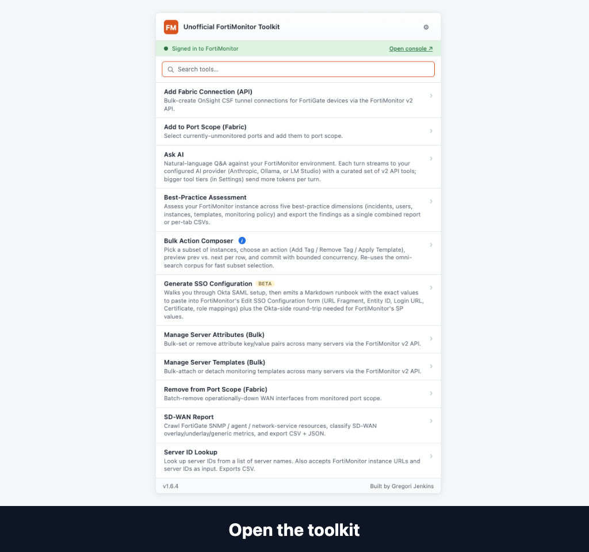

## Why this exists

FortiMonitor's web UI is built around the single-device case: configure port scope, attach a template, set an attribute, tag an instance, one device at a time, with no bulk equivalent. Some of those operations have v2 API endpoints, but the public CLIs require operators to paste fully-resolved resource URLs per device, which is no better than clicking through the UI. Running either flavour against 80+ devices manually is not a reasonable ask. This extension folds both classes (UI-session-only and v2-API-only) into one Load → Review → Execute UX, with **Bulk Composer** as the shared entry point and standalone tools available for cases that need a different shape.

It also makes everyday single-device use of FortiMonitor a little less painful: sub-columns for IP / DNS / Model on the All Instances page, no more full-page reload after editing template metrics, paste-and-resolve omni-search, and more. See [Quality-of-Life Improvements](#quality-of-life-improvements-to-the-fortimonitor-web-ui) below.

## Tools

| Tool | Auth | Status | Action |
|---|---|---|---|
| **Bulk Composer** | FortiMonitor v2 API key | Shipped (v1.0) | The flagship loop. Load a list of instances (paste, omni-search, sender handoff, or CSV), pick one of five actions, preview the per-row plan, then commit. Actions: **Add Tag**, **Remove Tag**, **Apply Template**, **Apply Best-Practice Fabric Templates** (profile Fabric devices, create Monitoring Policies that auto-apply matching templates), **Profile + Create Templates** (Jaccard-cluster devices by config similarity, create one template per cluster). See the [Bulk Composer](#bulk-composer) subsection below. |
| **Add Fabric Connection (API)** | FortiMonitor v2 API key | Shipped (v1.0) | Bulk-create OnSight CSF tunnel connections for FortiGate devices via `POST /v2/fabric_connection`. Resource pickers (OnSight, server group, optional appliance group) populate from the API. |
| **Manage Server Attributes (Bulk)** | FortiMonitor v2 API key | Shipped (v0.5) | Bulk-set or remove attribute key/value pairs across many servers via `POST`/`DELETE /v2/server/{id}/server_attribute`. Paste a list of server names or IDs, pick an attribute type, preview per-row plan (add / replace / skip / error), then execute. |
| **Manage Server Templates (Bulk)** | FortiMonitor v2 API key | Shipped (v1.0) | Bulk-attach or detach monitoring templates via `POST`/`DELETE /v2/server/{id}/template`. Detach offers two strategies: `dissociate` (keep metrics the template seeded) and `delete` (wipe metrics, **destructive, no undo**). Destructive detach and large batches require a typed-confirmation phrase. Receiver for the cross-tool *Send selection to* handoff. |
| **Server ID Lookup** | FortiMonitor v2 API key | Shipped (v0.7) | Resolve a list of server names (or instance URLs, or numeric IDs) to canonical FortiMonitor server IDs. Exports CSV. Read-only. Sender for the cross-tool *Send selection to* handoff. |
| **Remove from Port Scope (Fabric)** | FortiMonitor session | Shipped (v0.1) | Batch-remove operationally-down WAN interfaces from monitored port scope on Fabric-connected FortiGate instances. Destructive (deletes agent resources and metric history per removed port). Will fold into Bulk Composer in a future phase. |
| **Add to Port Scope (Fabric)** | FortiMonitor session | Shipped (v0.2) | Inverse of Remove. Batch-add currently-unmonitored interfaces to port scope. Non-destructive. Will fold into Bulk Composer in a future phase. |
| **Ask AI** | FortiMonitor v2 API key + AI provider credentials | Shipped (v1.0) | In-plugin chat with tool use against a curated set of read-only FortiMonitor v2 endpoints (servers, outages, agent resources, fabric connections, templates, server groups) plus a single gated write (`acknowledge_outage`). Provider is operator's choice in popup → ⚙ Settings: **Anthropic** (cloud, your API key, full 276-tool codegen catalog, prompt-caches tool definitions), **Ollama** (local, native `/api/chat`, no per-turn cost), or **LM Studio** (local, OpenAI-compat). Local providers must use a tool-capable model (Qwen 2.5+, Llama 3.1+, Mistral Nemo, Command R+, Qwen 3). See [`docs/mcp-chat-prototype.md`](docs/mcp-chat-prototype.md) for scope and [`docs/ask-ai-local-providers.md`](docs/ask-ai-local-providers.md) for local-provider setup. |
| **Find Servers** | FortiMonitor v2 API key | Shipped (v1.0) · hidden by default | Pages the full `/v2/server` list and filters client-side by identifiers, attribute (built-in like Model / OS, or any customer-defined type), name, FQDN, tag, status, device type, active-outage state, or applied template. Pick the columns you want and export matches as CSV. Read-only. Sender for the cross-tool *Send selection to* handoff. Enable in popup → ⚙ Settings → Experimental tools → *Show Search Servers*. |
| **Best-Practice Assessment** | FortiMonitor v2 API key | Beta · hidden by default | Audit a tenant for monitoring-config gaps: stock-vs-custom template drift, default-only instances, overlapping templates, user activity, etc. Outputs a downloadable CSV plus a multi-tab in-plugin viewer. Enable in popup → ⚙ Settings → Experimental tools. |
| **SD-WAN Report** | FortiMonitor v2 API key | Beta · hidden by default | Generate a per-tenant report of SD-WAN performance and alert configuration across Fabric-connected FortiGates. Enable in popup → ⚙ Settings → Experimental tools. |
| **Generate SSO Configuration** | None (local-only) | Beta · hidden by default | Compose the SAML-SSO configuration for FortiMonitor's per-field admin form (no XML import is supported on the FortiMonitor side; this tool produces the field set you paste). Enable in popup → ⚙ Settings → Experimental tools. |

Click the extension's toolbar icon to open the launcher and pick a tool. Each tool opens its own full-tab UI with a Load → Review → Execute → Results flow (port-scope tools add a Queue step in the middle).

### Bulk Composer

Bulk Composer is the toolkit's primary loop. Five steps:

1. **Load** - paste a list of names or IDs, use omni-search, accept a *Send selection to* handoff from Find Servers or Server ID Lookup, or upload a CSV.
2. **Action** - pick one of the shipped actions.
3. **Configure** - action-specific parameters (tag name, template ID, similarity threshold, etc.).
4. **Preview** - per-row plan with prev → next diff, "skip" status for rows that already match, error markers for rows that can't be processed.
5. **Commit** - live writes with progress, per-row outcome CSV download.

Shipped actions:

- **Add Tag** - add a single tag to each selected instance. Existing tags are preserved.
- **Remove Tag** - remove a single tag from each selected instance. Other tags are preserved.
- **Apply Template** - attach a monitoring template. Already-attached instances are skipped.
- **Apply Best-Practice Fabric Templates** - profile Fabric devices and create Monitoring Policies (rulesets) that auto-apply matching templates on future onboard.
- **Profile + Create Templates** - Jaccard-cluster Fabric devices by configuration similarity, propose one template per cluster, then create + attach.

Port-scope actions and the dedicated Server Templates / Server Attributes tools have not been folded into Bulk Composer yet and remain standalone for now. The plan is to migrate them once Bulk Composer's action surface stabilises.

<details>
<summary>Screenshots</summary>

**Popup launcher**

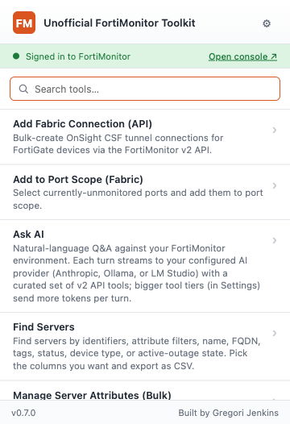

**Remove from Port Scope (Fabric)**

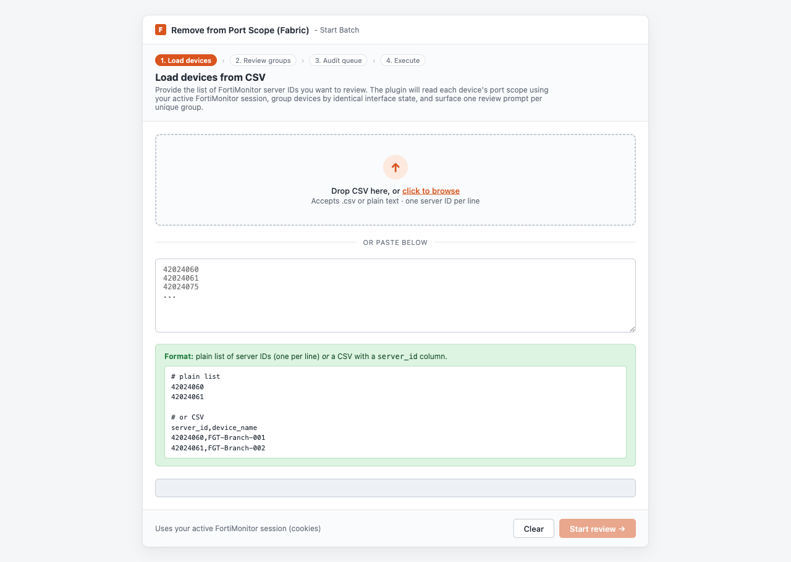

**Add to Port Scope (Fabric)**


**Add Fabric Connection (API)**

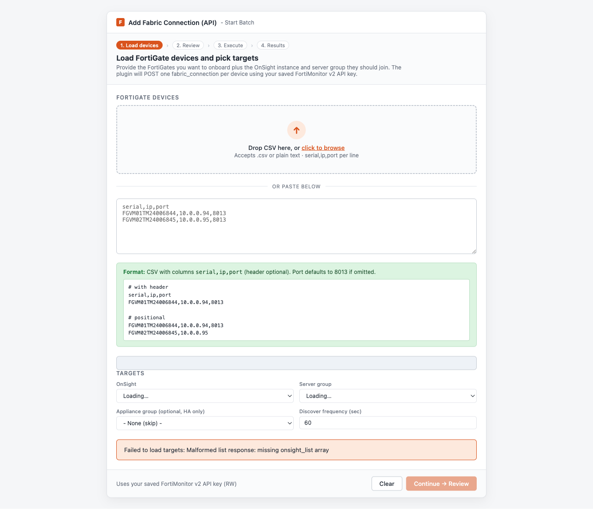

**Manage Server Attributes (Bulk)**

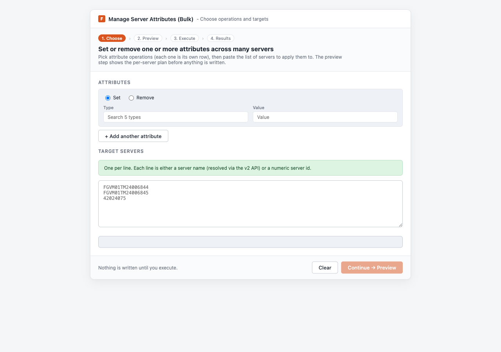

**Server ID Lookup**

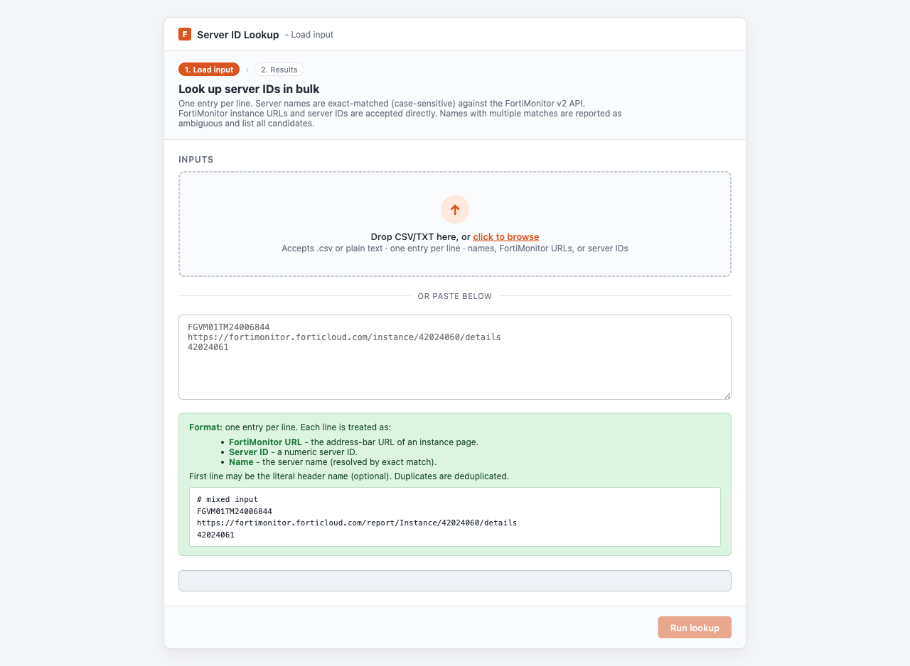

**Manage Server Templates (Bulk)**

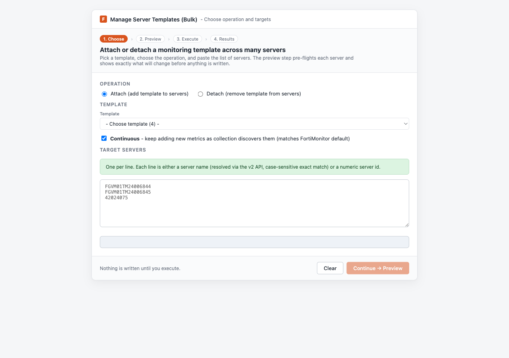

**Ask AI**

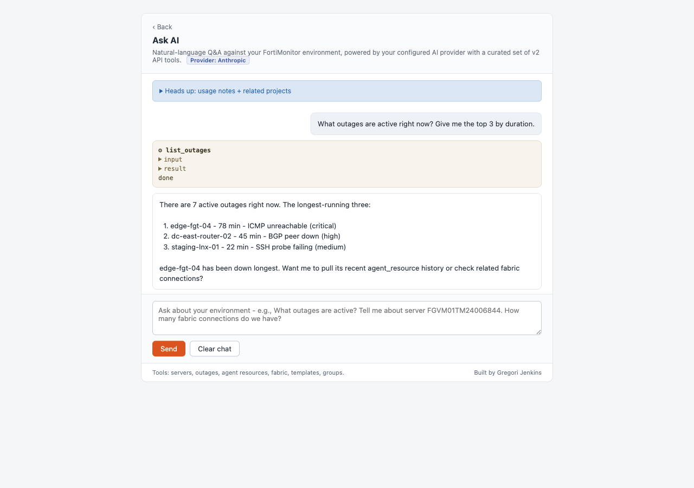

**Find Servers**

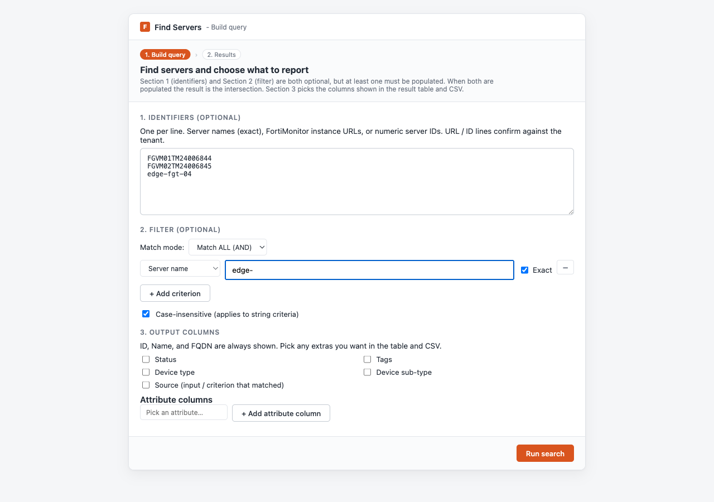

### Beta tools

Hidden by default; opt in via popup → ⚙ Settings → Experimental tools.

**Best-Practice Assessment** (Beta)

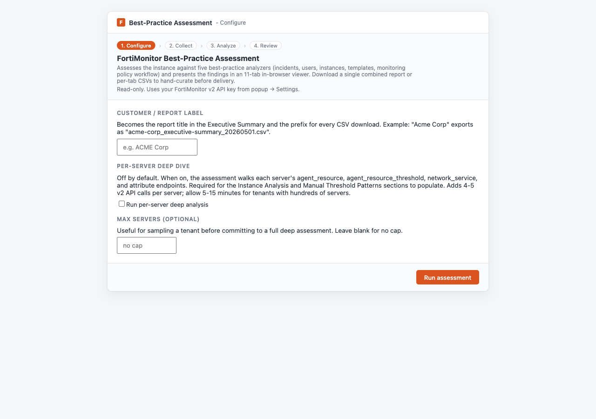

**SD-WAN Report** (Beta)

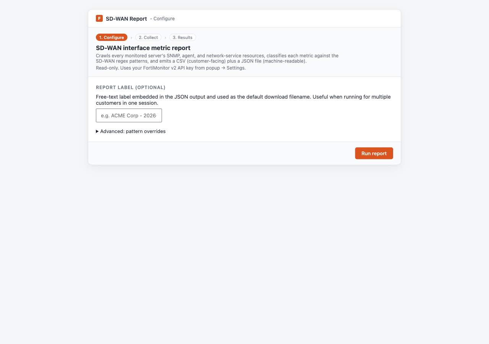

**Generate SSO Configuration** (Beta)

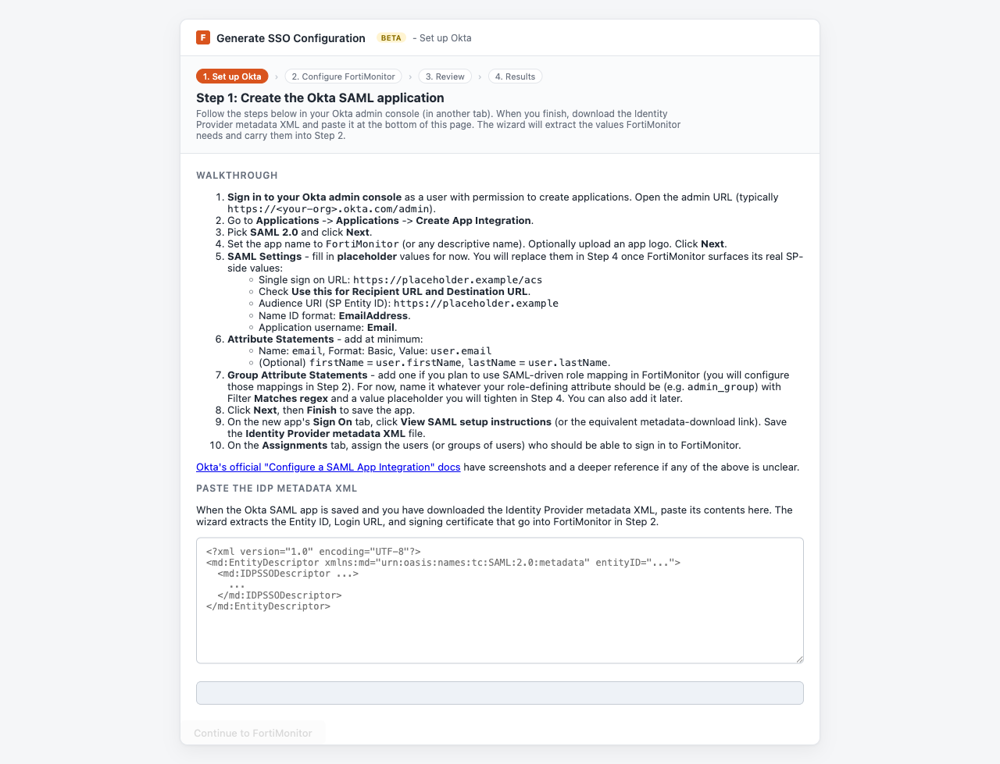

</details>

### Cross-tool handoff

Sender tools (Find Servers, Server ID Lookup) include row checkboxes plus a **Send selection to ▾** dropdown in their results bar. Picking a receiver writes the selection to `chrome.storage.session` (5-minute TTL), opens the receiver in a new tab, and the receiver consumes the blob on mount to prefill its entries. Receivers today: Bulk Composer, Manage Server Templates, Manage Server Attributes. Single-shot consume; back-button revisits do not duplicate prefills.

### Quality-of-Life Improvements to the FortiMonitor Web UI

Separate from the launcher and the bulk tools, the extension also injects small improvements directly into FortiMonitor pages the operator already has open. Each one targets a specific friction point of everyday single-device use.

- **See IP, DNS, model, and OS at a glance on the All Instances page.** `/report/ListServers` gets **IP Address**, **DNS Name**, **Type**, **Model**, **Model #**, and **OS** as sub-columns inside the existing Instance cell, so you don't have to click into each instance to read its basics. Reorder and hide sub-columns via a popup setting; preferences persist.
- **Edit a template's monitoring config without losing your place.** When you change a metric inside the Template Monitoring Config drawer, FortiMonitor's default behaviour is a full-page reload that bounces you back to the top and collapses the drawer. The extension intercepts that, patches the open Vue drawer in place, and lets you keep editing where you left off.
- **Launch the toolkit straight from FortiMonitor's own side nav.** Optional **FM Toolkit** entry opens the launcher as an in-page overlay instead of forcing you up to the toolbar popup. Off by default; opt in via popup → ⚙ Settings → *FortiMonitor sidebar entry*.
- **Paste a list of servers and see matches inline as you type.** The omni-search box resolves names, FQDNs, or IDs against the cached server list with no round-trip to a search page; useful for staging a Bulk Composer or handoff input directly from the FortiMonitor side.
- **Contextual help anchored to the controls that benefit from a one-liner.** Lightweight info bubbles attach to specific FortiMonitor settings that aren't self-explanatory.
- **Guided walkthrough of FortiMonitor surfaces (Beta).** Tour FortiMonitor launches from the popup's Training section and walks new operators through where things live. Off by default; opt in via popup → ⚙ Settings → *Tour FortiMonitor*.

## Install (developer mode)

1. Clone this repository.
2. Open `chrome://extensions/`.
3. Toggle **Developer mode** on (top right).
4. Click **Load unpacked** and select the `extension/` directory.
5. Log into [fortimonitor.forticloud.com](https://fortimonitor.forticloud.com) in any tab. The extension rides whatever session you already have.
6. Click the extension's toolbar icon to open the launcher.

See [`extension/README.md`](extension/README.md) for detailed install, tool, and testing notes.

## Architecture

```
extension/
  manifest.json
  src/
    popup/          - toolbar popup launcher
    background/     - service worker, tool-specific orchestration
    lib/            - shared infrastructure (FortiMonitor client,
                      queue, retry, concurrency, fingerprint,
                      DOM helpers, messaging, bulk-actions registry)
    content/        - page-side augmentations (FM Toolkit sidebar
                      entry, ListServers sub-columns, Template
                      Monitoring Config drawer patch, omni-search,
                      info bubbles, intro tour)
    ui/             - tool UI shells + per-step modules
                      ui/app.html               (port-scope tools)
                      ui/bulk-composer/app.html (Bulk Composer)
                      ui/fabric-connection/app.html
                      ui/attribute-management/app.html
                      ui/template-management/app.html
                      ui/server-lookup/app.html
                      ui/server-search/app.html
                      ui/ask-claude/app.html
                      ui/bpa-audit/app.html
                      ui/sdwan-report/app.html
                      ui/sso-config/app.html
                      ui/intro-tour/app.html
  tests/            - Node test runner unit tests

docs/
  api-discovery/    - captured FortiMonitor internal API contracts
  mockups/          - static HTML mockups for tool flows + augmentations
  harnesses/        - synthetic HTML fixtures used during dev verification
  marketing/        - README hero GIF, per-tool stills, social-preview.png
                      (regenerated by `npm run capture:marketing`)
  live-e2e-runbook.md       - operator walkthrough for live API tests
  playwright-e2e-runbook.md - Playwright e2e suite walkthrough
```

## Scope guardrails

- **Per-tool auth choice.** Tools whose capability is UI-only (port-scope) ride the FortiMonitor browser session. Tools whose capability has a clean v2 endpoint (fabric_connection, tags, templates, attributes) use a user-supplied RW API key. Neither auth model leaks across tools.
- **Dry-run is the default** for every batch. Write-capable tools require a typed confirmation phrase before live writes.
- **`fortilink`** (fabric link) is visually flagged across every port-scope tool; it's protected by name.
- **Port-scope tools assume Fabric-connected FortiGate instances.** Add Fabric Connection itself onboards FortiGates that aren't yet under a fabric, so it has no such constraint.

## Development

```bash
cd extension
npm test    # runs the full unit-test suite via Node's built-in test runner
```

No `npm install` required; the only `devDependencies` the tests use ship with Node.

## Contributing

This is currently a personal project. Issues and suggestions are welcome via GitHub Issues.

## About the Developer

Built by **Gregori Jenkins** - originally from Chicago, a humble student of Computer Science, and a proud cat dad.

[Connect on LinkedIn](https://www.linkedin.com/in/gregorijenkins)
